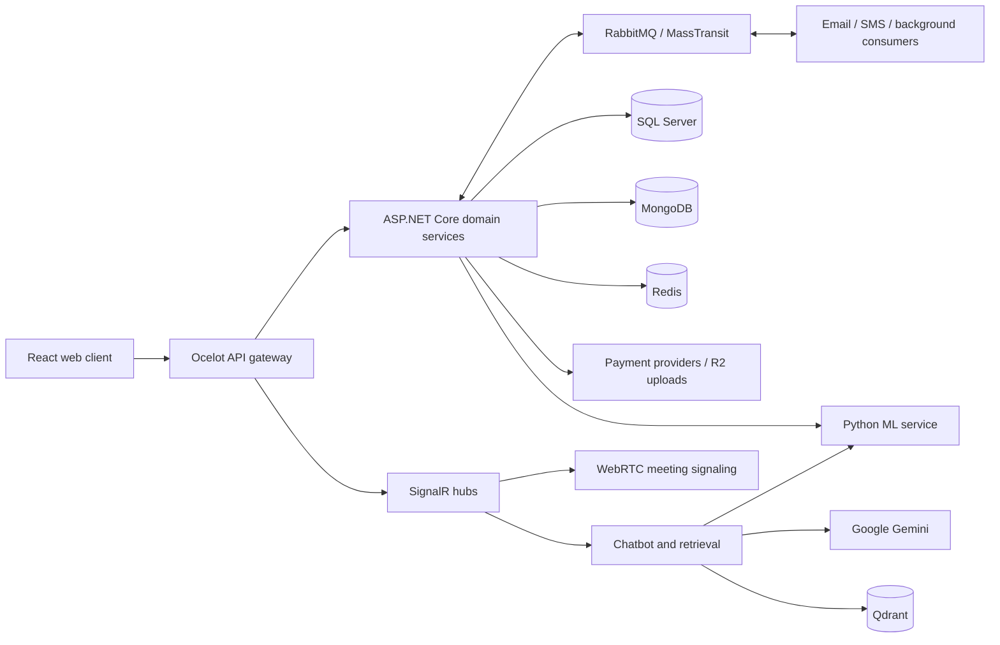

# Along Hospital

Along Hospital is a full-stack hospital management application. It combines a public hospital website and patient portal with workspaces for clinical staff, pharmacy, reception, human resources, accounting, and hospital management.

This repository contains a React web client, an ASP.NET Core microservices backend, and a Python machine-learning service. The source covers appointment booking, consultations, inpatient care, medicine sales, billing, staff operations, and reporting. The interface includes English and Vietnamese translations and light/dark themes.

## Main capabilities

| Area | Features in the source |
| --- | --- |
| Public website | Hospital information, doctors and specialties, medical services, medicine catalog, articles, job postings, and job applications. |
| Patient portal | Registration and Google sign-in, patient profiles, appointment booking and payment, medical history, telehealth meetings, medicine shopping, orders, vouchers, and feedback. |
| Clinical care | Reception and room queues, examinations, diagnoses, prescriptions, clinical orders, infusions, care instructions, and encounter completion. |
| Inpatient care | Buildings, floors, rooms, beds, occupancy, bed assignment and transfer, discharge, and bed charges. |
| Pharmacy and supply | Medicine categories, units and SKU variants, carts, orders, supplier imports, stock tracking, and low-stock notifications. |
| Finance | Consultation and treatment invoices, payment transactions, refunds, payroll policies, salary advances, and financial reports. |
| Workforce | Staff profiles, qualifications, contracts and certificates, schedules, attendance with face recognition, leave requests, payroll, and recruitment. |
| Communication and analytics | Email/SMS notifications, live queue boards, meeting chat, hospital chatbot, feedback analysis, complaint classification, dashboards, and Excel exports. |

### User roles

The application defines eleven authenticated roles. Public browsing is available without an account; `/staff` contains shared employee features rather than a separate staff role.

| Role | Main workspace |
| --- | --- |
| Patient | Appointments, medical records, telehealth, shopping, orders, and profile. |
| Doctor | Appointments, consultations, medical records, clinical orders, and telehealth. |
| Nurse | Patient care, clinical tasks, and inpatient bed operations. |
| Receptionist | Patient intake, medical histories, time slots, and queues. |
| Pharmacist | Medicine catalog, pharmacy orders, prescriptions, and import approvals. |
| InventoryClerk | Suppliers, import requests, receiving, and stock reporting. |
| HR | Staff, contracts, certificates, schedules, leave, payroll settings, and recruitment. |
| Accountant | Billing, refunds, payroll, and financial reporting. |
| Marketer | Articles and article categories. |
| HotlineAgent | Patient feedback, complaints, and moderation. |
| Manager | Hospital configuration, attendance management, approval workflows, and cross-department reporting. |

Role routes are declared in [client routes](along-hospital-client/src/routes). Backend permissions are defined on individual controllers and actions.

## Architecture



The browser calls versioned APIs through the gateway under `/api/v1`. Ocelot forwards requests to the appropriate service and includes WebSocket routes for realtime features. Domain services communicate through MassTransit over RabbitMQ using both request/response messages and published events. Some reads also request data from other services, so starting one API alone may not be enough for its workflows.

Most services follow the same three-layer structure:

```text
ExampleService/
  ExampleSvc.WebAPI/    Controllers, consumers, background jobs, startup
  ExampleSvc.BLL/       Business rules, DTOs, mappings, service interfaces
  ExampleSvc.DAL/       Models, database context, seeds, migrations
```

SQL-backed services have separate databases on a shared SQL Server instance. Payment, Voucher, and MedicalOrder use MongoDB. Redis supports caching and token blacklisting. Chatbot retrieval uses Qdrant; conversation history is held in memory per connection. Python models provide face recognition, text classification, and vector embeddings.

### Technology stack

Versions below describe the checked-in dependency files.

| Layer | Technologies |
| --- | --- |
| Web application | JavaScript/JSX, React 19, Vite 7, React Router 7, Material UI 7, Redux Toolkit, Axios. |
| UI features | FullCalendar, MUI Charts, Tiptap, QR scanning, signatures, media recording, and custom localization hooks. |
| Backend | C#, .NET 8 / ASP.NET Core, Entity Framework Core 9, AutoMapper, Gridify, and Swagger/OpenAPI. |
| Routing and messaging | Ocelot 24, MassTransit 8, RabbitMQ, SignalR, and WebRTC. |
| Storage | SQL Server 2022, MongoDB 7, Redis 7, Qdrant, and Cloudflare R2. |
| Machine learning | Python 3.12 container, Flask, scikit-learn, TensorFlow/Keras, DeepFace, FAISS, and sentence-transformers. |
| Operations | Docker Compose, Docker Swarm, Portainer, .NET Aspire, OpenTelemetry, Serilog, Prometheus, Grafana, Loki, and Tempo. |

See [package.json](along-hospital-client/package.json), [package-lock.json](along-hospital-client/package-lock.json), [SharedLibrary.csproj](along-hospital-server/SharedLibrary/SharedLibrary.csproj), and [Python requirements](along-hospital-server/CommonServices/MachineLearningSvc/requirements.txt) for dependency details.

## Source guide

```text
.
├── along-hospital-client/
│   ├── src/
│   │   ├── pages/          Public, patient, and employee screens
│   │   ├── routes/         Role routes and route protection
│   │   ├── components/     Reusable UI components
│   │   ├── layouts/        Shared page layouts
│   │   ├── configs/        API URLs, Axios, auth, themes, role configuration
│   │   ├── hooks/          Shared data and UI hooks
│   │   ├── redux/          Application state
│   │   ├── locales/        English and Vietnamese translations
│   │   └── utils/          Formatting and common helpers
│   ├── public/            Static assets and runtime environment script
│   ├── scripts/           Container environment configuration
│   ├── vite.config.js     Development server and import alias
│   └── Dockerfile         Node build followed by Nginx hosting
└── along-hospital-server/
    ├── ApiGateway/        Gateway startup and environment-specific routes
    ├── *Service/          Domain services listed below
    ├── CommonServices/    Email, SMS, uploads, and Python ML
    ├── SharedLibrary/     Shared controllers, repositories, auth, utilities
    ├── MessageBroker/     Message contracts, events, and response models
    ├── along-hospital-server.AppHost/          Aspire orchestration
    ├── along-hospital-server.ServiceDefaults/ Telemetry and health endpoints
    ├── scripts/           EF migration helper scripts
    ├── infra/             Nginx and observability configuration
    ├── docker-compose*.yml Local containers and environment mappings
    └── *-stack.yml        Swarm infrastructure, application, monitoring
```

### Backend service map

Folder names are relative to `along-hospital-server/`.

| Folder | Responsibility |
| --- | --- |
| `AuthService` | Registration, email/phone verification, login, Google login, password reset, JWTs, refresh cookies, and logout. |
| `UserService` | Account-linked user profiles, photos, profile completion, and user/role lookups. |
| `PatientService` | Patient medical profiles, medical numbers, allergies, and account-linked patient creation. |
| `StaffService` | Staff profiles, specialties, qualifications, groups, contracts, certificates, and regional wages. |
| `AppointmentService` | Booking, time slots, appointment payments, cancellations, reminders, and telehealth booking integration. |
| `QueueService` | Patient intake, room queues, encounter assignment, queue transitions, and live queue updates. |
| `MedicalHistoryService` | Encounters, examination records, diagnoses, prescriptions, discharge, and patient complaints. |
| `MedicalOrderService` | Clinical service orders, infusion orders, care instructions, and execution outcomes. |
| `MedicalServiceService` | Medical-service catalog, pricing, specialties, and availability by role. |
| `InpatientResourceService` | Hospital buildings, floors, rooms, beds, bed assignment, transfers, discharge, and occupancy pricing. |
| `TeleHealthService` | Virtual rooms and sessions, appointment access checks, meeting chat, and WebRTC signaling. |
| `BillingService` | Medical invoices, consultation/treatment/bed charges, cancellations, and refunds. |
| `MedicineService` | Medicine catalog, categories, units, SKU variants, options, and stock/discount enrichment. |
| `CartService` | Patient carts, selected items, discount pricing, and checkout. |
| `OrderService` | Medicine orders, price snapshots, payments, cancellation, shipping, and completion. |
| `PaymentService` | Cash, PayOS and SePay transactions, payment notifications, and payroll payments. |
| `SupplierService` | Suppliers, import requests, approval/rejection, and receiving purchased stock. |
| `InventoryService` | Stock lookups and adjustments through message consumers, plus low-stock alerts. |
| `VoucherService` | Voucher definitions, patient collections, eligibility, discounts, and expiration. |
| `BlogService` | Public articles and editorial management of posts and categories. |
| `FeedbackService` | Medicine reviews, replies, reports, moderation, and sentiment/toxicity integration. |
| `AttendanceService` | Attendance logs, face enrollment/recognition, check-in/out, and work-segment generation. |
| `WorkScheduleService` | Shifts, holidays, templates, assignments, work segments, finalization, and payroll events. |
| `StaffRequestService` | Leave requests, salary advances, approval workflows, and payroll settlement. |
| `PayrollService` | Payroll policies, salary calculations, allowances/deductions, taxes, approval, and payment tracking. |
| `RecruitmentService` | Job postings, CV applications, interview types, interviews, results, and notifications. |
| `ReportService` | Cross-service dashboards, statistics, and Excel exports; no separate DAL project. |
| `ChatboxService` | Gemini chatbot, retrieval from hospital catalog data, vector indexing, and complaint summaries. |
| `ProductService` | Generic product/category CRUD example; excluded from the active Compose services and commented out in AppHost. |

`CommonServices/EmailSvc`, `SmsSvc`, and `UploadSvc` integrate SendGrid, Twilio SMS, and Cloudflare R2 respectively. `CommonServices/MachineLearningSvc` exposes Flask endpoints for complaint classification, feedback sentiment/toxicity, staff recognition, and embeddings.

### Where to start reading

- [App.jsx](along-hospital-client/src/App.jsx) assembles client providers and role workspaces.
- [apiUrls.js](along-hospital-client/src/configs/apiUrls.js) and [axiosConfig.js](along-hospital-client/src/configs/axiosConfig.js) define API access and token refresh behavior.
- [AuthProvider.jsx](along-hospital-client/src/configs/AuthProvider.jsx) restores the browser session; [ProtectedRoute.jsx](along-hospital-client/src/routes/ProtectedRoute.jsx) applies client route access rules.
- [Gateway Program.cs](along-hospital-server/ApiGateway/Program.cs) and [Ocelot routes](along-hospital-server/ApiGateway/ocelot.Production.json) show how incoming requests reach services.
- Each service's `Program.cs` and `DependencyInjection.cs` connect its controllers, business services, persistence, and message consumers.
- [SharedLibrary](along-hospital-server/SharedLibrary) contains the shared CRUD, query, validation, response, database, and security conventions.
- [MessageBroker](along-hospital-server/MessageBroker) defines the contracts used to trace workflows across service boundaries.

## Representative workflows

1. **Appointment and consultation:** A patient chooses a specialty and time slot. Booking creates an appointment and, for telehealth, a session. Successful payment creates a medical history and its paid consultation invoice. Due paid in-person appointments enter the queue, where staff manage consultation progress.
2. **Treatment and discharge:** Clinical orders request invoices from Billing. Payment events update the orders; failed clinical items can request refunds. Inpatient discharge calculates bed charges and releases occupancy. Encounter completion checks outstanding invoices and active bed occupancy.
3. **Medicine purchase:** Cart checkout requests an Order with medicine/SKU snapshots, stock checks, and voucher pricing. Payment and order state changes drive stock updates and cancellation restoration through the message broker.
4. **Attendance and payroll:** Face recognition supports attendance recording. Attendance and schedule assignments become work segments. Finalizing schedules publishes payroll creation events; payroll combines contracts, policies, taxes, and advances before approval and payment.

## Running locally

Commands below use PowerShell. Run each group from the indicated directory. The complete backend starts many services and the ML image has substantial dependencies; first-time builds can take time.

### Prerequisites

- Docker with Linux containers and the Docker Compose plugin for the container workflow.
- Node.js **22.12 or newer in the 22.x line** and npm for client development; the checked-in Vite dependencies require Node `^20.19.0 || >=22.12.0`.
- .NET 8 SDK for running/building C# projects outside containers.
- Python 3.12 and Microsoft ODBC Driver 18 for SQL Server only if running the ML service outside its Docker image.
- Provider credentials for the integrations you intend to exercise, such as Google login, notifications, uploads, online payments, and Gemini.

### 1. Configure the backend

From the repository root:

```powershell
cd along-hospital-server
if (-not (Test-Path .env)) { Copy-Item .env.example .env }
```

Edit `.env` before starting services. Use [.env.example](along-hospital-server/.env.example) as a key inventory and supply your own credentials and endpoint values. Keep `SQL_SA_PASSWORD` and `DB_PASSWORD` aligned when using the bundled SQL Server with `DB_USER=sa`. Keep JWT settings consistent across the gateway and services.

For the HTTP Docker workflow below, use these local URL/cookie settings:

```dotenv
FRONTEND_URL=http://localhost:3000
BACKEND_URL=http://localhost:8000/api/v1
REFRESH_TOKEN_SECURE=false
REFRESH_TOKEN_DOMAIN=
```

Use Compose DNS names for connections between containers: `sqlserver`, `mongodb`, `redis:6379`, `amqp://rabbitmq:5672`, and `qdrant`. Internal upload and ML URLs are `http://upload-svc:8080` and `http://machine-learning-svc:4996`.

The [Compose override](along-hospital-server/docker-compose.override.yml) translates `.env` names into ASP.NET configuration keys such as `DatabaseConfig__ConnectionString`. A plain `dotnet run` does not automatically read this server `.env` file.

### 2. Start the backend

From `along-hospital-server/`:

```powershell
docker compose config --quiet
docker compose up -d --build
docker compose ps
```

The default Compose command merges `docker-compose.yml` with `docker-compose.override.yml`. It starts infrastructure, common services, the gateway, and the configured domain services. The client is built separately.

For development with APIs running on the host, you can start only infrastructure:

```powershell
docker compose up -d sqlserver mongodb redis rabbitmq qdrant
```

Useful lifecycle commands, also from the server directory:

```powershell
docker compose logs --tail 100 api-gateway auth-svc
docker compose up -d --build appointment-svc
docker compose down
```

`docker compose down` retains the named database volumes. Features may need additional domain services beyond their container's declared startup dependencies.

### 3. Configure and run the client

From the repository root, in another terminal:

```powershell
cd along-hospital-client
if (-not (Test-Path .env)) { Copy-Item .env.example .env }
```

Set the client environment for the HTTP backend:

```dotenv
VITE_BASE_API_URL=http://localhost:8000/api/v1
VITE_SYSTEM_NAME=Along Hospital
VITE_IMAGE_CLOUD_URL=<your public upload base URL>
VITE_GOOGLE_CLIENT_ID=<your Google OAuth client ID>
```

Include `/api/v1` in `VITE_BASE_API_URL` and omit the trailing slash. Set it explicitly: some realtime connections use this value directly. All `VITE_*` settings are visible to the browser, so they must not contain server secrets.

To serve the client over HTTP using its existing Docker image setup:

```powershell
docker build -t along-hospital-client:local .
docker run --rm --name along-hospital-client-local -p 3000:80 --env-file .env along-hospital-client:local
```

Open `http://localhost:3000`. The Nginx container creates `env-config.js` from runtime `VITE_*` variables; `getEnv()` checks that configuration before Vite's build-time values. The API URL is resolved by the browser, so use a browser-reachable address rather than a Docker service name.

Alternatively, run the client with hot reload. If the client container is already running, stop it with `docker stop along-hospital-client-local` to free port 3000.

Before starting Vite, align its protocol with the API. The checked-in [vite.config.js](along-hospital-client/vite.config.js) serves **HTTPS on port 3000** and reads `localhost+2-key.pem` and `localhost+2.pem`. For the HTTP Compose setup above, remove the `server.https` block from your local Vite configuration so the client also runs at `http://localhost:3000`. To keep HTTPS, use trusted local certificates, an HTTPS API endpoint, and matching secure-cookie settings. The native .NET gateway's HTTPS profile uses `https://localhost:5000/api/v1`; the Compose gateway exposes HTTP at port 8000.

Then, from `along-hospital-client/`:

```powershell
npm ci
npm run dev
```

### Local endpoints

| Component | Default Compose address |
| --- | --- |
| Client, when started with the command above | `http://localhost:3000` |
| API gateway | `http://localhost:8000/api/v1` |
| Gateway health / liveness | `http://localhost:8000/health`, `http://localhost:8000/alive` |
| Auth Swagger, in Development | `http://localhost:8001/swagger` |
| Domain APIs | HTTP ports `8001` through `8028`; see the Compose override for the service mapping. |
| Python ML | `http://localhost:7996` |
| Upload / SMS / Email | HTTP ports `7998` / `7997` / `7999`. |
| RabbitMQ management | `http://localhost:15672` |
| SQL Server / MongoDB / Redis | `localhost:1433` / `localhost:27017` / `localhost:6379`. |
| Qdrant HTTP / gRPC | `localhost:6333` / `localhost:6334`. |
| Portainer | `http://localhost:9000` or `https://localhost:9443`. |

Swagger is enabled on individual APIs in Development. The gateway does not aggregate their Swagger documents. Default health checks establish process liveness; review service logs and exercise the relevant API to verify database and integration readiness.

### Native .NET and Aspire development

Configure each service using its `appsettings` files, user secrets, or ASP.NET environment variables before running it. For example, `DatabaseConfig__ConnectionString`, `RabbitMQConfig__Host`, and `RedisConfig__Host` must point to host-accessible dependencies. The gateway's `ocelot.Development.json` targets individual localhost HTTPS ports; its Production routes target container names over HTTP. Compose explicitly selects Production routes for the gateway.

From `along-hospital-server/`:

```powershell
dotnet restore along-hospital-server.sln
dotnet build along-hospital-server.sln --no-restore
dotnet dev-certs https --trust
dotnet run --project AuthService/AuthSvc.WebAPI --launch-profile https
```

[AppHost.cs](along-hospital-server/along-hospital-server.AppHost/AppHost.cs) provides Aspire orchestration for the APIs and Python service. It expects external infrastructure and a prepared Python `.venv`; it does not provision the databases or replace per-service configuration. After preparing those dependencies, its entry command is:

```powershell
dotnet run --project along-hospital-server.AppHost
```

### Running only the Python ML service

Set `DB_HOST`, `DB_PORT`, `DB_USER`, `DB_PASSWORD`, `DB_NAME_MEDICAL_HISTORY`, and `DB_NAME_FEEDBACK` in the process environment. Then, from `along-hospital-server/CommonServices/MachineLearningSvc/`, with Python 3.12 and ODBC Driver 18 installed:

```powershell
python -m venv .venv
.\.venv\Scripts\python.exe -m pip install -r requirements.txt
.\.venv\Scripts\python.exe -m flask --app wsgi run --host 127.0.0.1 --port 7353
```

Set each calling API's `ApiUrlsConfig__MachineLearningUrl` to the reachable ML address. The Docker image listens on 4996 internally, while this native example uses 7353.

Model initialization may download model weights and NLTK resources. Model artifacts and enrolled staff images need writable storage; configure persistence when retaining them across container replacement.

## Configuration and API conventions

Backend configuration types are centralized in [AppConfiguration.cs](along-hospital-server/SharedLibrary/Commons/AppConfiguration.cs). Only configure the integrations used by the services you run.

| Configuration area | Main keys / purpose |
| --- | --- |
| Databases | `DB_HOST`, `DB_PORT`, `DB_USER`, `DB_PASSWORD`, `DB_NAME_*`, `DB_HOST_MONGO`, `MONGO_ROOT_*`, `MONGO_DB_NAME_*`. |
| Cache and messages | `REDIS_HOST`, `REDIS_PASSWORD`, `REDIS_INSTANCE_NAME`, `RABBITMQ_HOST`, `RABBITMQ_USERNAME`, `RABBITMQ_PASSWORD`. |
| Authentication | `JWT_*`, `REFRESH_TOKEN_*`, `GOOGLE_CLIENT_ID`; local cookie domain must match the API host or be empty. |
| Notifications | `SENDGRID_API_KEY`, `EMAIL_ADDRESS`, `EMAIL_DISPLAY_NAME`, and `TWILIO_*`. Twilio is the active SMS registration; a TextBee implementation and `TEXTBEE_*` settings exist but require changing that registration. |
| Uploads | `R2_*` credentials, bucket, and public base URL. |
| Payments | `PAYOS_*` and `SEPAY_*`; redirects and callbacks also depend on frontend/backend URLs. Currency conversion uses `ExchangeRateConfig__ApiKey` in PaymentService. |
| Chatbot | `GEMINI_API_KEY`, `QDRANT_*`, and the vector-embedding ML endpoint. |
| Internal HTTP calls | `API_UPLOAD_URL`, `API_MACHINE_LEARNING_URL`, `FRONTEND_URL`, `BACKEND_URL`. |
| Telehealth | `WebRtcConfig.IceServers` in service configuration, plus frontend/backend URLs. |
| Telemetry | `OTEL_EXPORTER_OTLP_ENDPOINT`, `OTEL_EXPORTER_OTLP_PROTOCOL`, and observability stack configuration. |

PaymentService's online providers use ExchangeRate-API for USD-to-VND conversion. The supplied Compose files do not bind `ExchangeRateConfig__ApiKey` from `.env`; add it to the payment service's environment or configure it through another ASP.NET configuration source.

Authentication uses bearer access tokens and an HttpOnly refresh-token cookie. The client Axios interceptor retries requests after token refresh. Common API responses use a `data`, `error`, and `message` envelope; shared query services provide filtering, ordering, and pagination. Consult each service's Swagger UI for its exact endpoints and DTOs.

Realtime routes exposed through the gateway are `/api/v1/hub/queue`, `/api/v1/hub/chatbot`, and `/api/v1/hubs/meeting`. WebRTC carries meeting media; SignalR handles signaling and chat. Meeting connection state and chatbot histories are held in process memory, so multi-instance deployment requires attention to connection routing and shared state.

## Databases and migrations

SQL services call the shared migration initializer during startup. Despite its name, `EnsureDatabaseCreatedAsync` applies EF Core migrations using `MigrateAsync`. Seed definitions are included in the DAL projects; Mongo services use the shared Mongo seeding mechanism. Startup migration failures are logged, so check logs when a service starts but database requests fail.

When changing an EF model, install a `dotnet-ef` 9.x tool version compatible with the EF Core packages, then generate a migration from `along-hospital-server/` using the helper or EF CLI:

```powershell
.\scripts\add-migrations.ps1 -Services @("Appointment") -MigrationName AddAppointmentField
```

The helper's default service list does not cover every current SQL service; explicitly select the service you are changing. The existing `remove-migration.ps1` deletes selected **Migrations directories**; it is not an EF database rollback command and is not part of normal setup.

## Build checks and deployment files

Client checks, from `along-hospital-client/`:

```powershell
npm run lint
npm run build
npm run preview
```

Server build, from `along-hospital-server/`:

```powershell
dotnet build along-hospital-server.sln
```

There is no frontend test script or dedicated .NET test project in this snapshot. The backend CI definition contains `dotnet test`, but that does not establish application test coverage.

Deployment sources include:

- [Client Dockerfile](along-hospital-client/Dockerfile) and [Nginx configuration](along-hospital-client/nginx.conf) for SPA hosting and runtime environment settings.
- [docker-compose.yml](along-hospital-server/docker-compose.yml) and its [override](along-hospital-server/docker-compose.override.yml) for local services, port mappings, and environment bindings.
- [infra-stack.yml](along-hospital-server/infra-stack.yml), [app-stack.yml](along-hospital-server/app-stack.yml), and [observability-stack.yml](along-hospital-server/observability-stack.yml) for Swarm. They expect an external `hospital-network`; infrastructure/monitoring target manager nodes and application services target worker nodes.
- [Observability configuration](along-hospital-server/infra/observability) for OpenTelemetry collection, Prometheus metrics, Loki logs, Tempo traces, and Grafana dashboards. Monitoring services are commented out in the local Compose file and need separate setup.
- Workflow definitions under each project's `.github/workflows/` for client image deployment, .NET build checks, and backend image/Portainer deployment. In this combined repository these folders are nested: GitHub Actions requires workflows under the repository-root `.github/workflows/`, with paths adapted to this layout, before they run automatically.

## Current implementation notes

- The generic `ProductService` is an example alongside the active medicine domain.
- VnPay configuration and SDK registration exist, but active payment workflows in the reviewed source use cash, PayOS, and SePay.
- External-provider features require valid credentials and callbacks reachable by their providers; starting containers alone does not configure those accounts.
